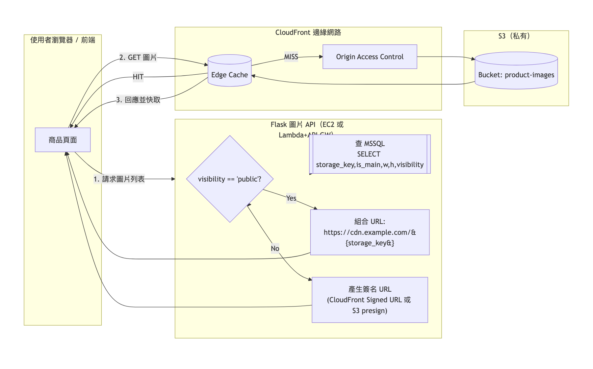

# beautyCX

這份專案是我的大學期末專題作品，主題是「美妝商品比價與會員收藏平台」。

這份 README 以作品集展示為目的撰寫，重點放在我負責的 `後端開發` 與 `雲端架構設計`。前端介面為團隊共同成果，本文件僅保留必要背景，讓 HR 或技術主管可以快速理解我的實作價值。

## HR 快速摘要

- 專案類型：大學期末團隊專題
- 我的角色：後端工程 + 雲端設計
- 核心目標：整合多通路美妝商品資料，提供搜尋、比價、價格歷史、會員登入、收藏追蹤與商品圖片服務
- 後端亮點：JWT 驗證、Redis 快取與回寫、SQL Server 資料模型、S3 + CloudFront 圖片交付、註冊通知串接 API Gateway
- 技術棧：Flask、SQLAlchemy、SQL Server、Redis、AWS S3、CloudFront、API Gateway、React

## 面試 1 分鐘速讀版

- 我負責這個美妝比價平台的後端 API 與雲端設計，主軸是「把商品、價格、會員、圖片服務整合成可運作的系統」
- 後端以 `Flask + SQLAlchemy + SQL Server` 建立商品列表、搜尋、商品明細、價格歷史、評論、收藏與會員系統
- 我設計 `JWT + refresh token + Redis blacklist` 的登入驗證流程，處理登入狀態與登出失效
- 我用 `Redis + SQL Server` 設計熱門商品點擊數快取與回寫機制，降低高頻更新直接打資料庫的成本
- 我把商品圖片從資料庫二進位欄位遷移到 `S3`，並透過 `CloudFront` 與簽名 URL 設計圖片交付方式
- 我也把註冊通知流程拆到 `API Gateway + Lambda + SES`，代表我不只寫 API，也有基礎雲端分層與服務整合能力

## 專案背景

`beautyCX` 想解決的問題是：使用者在購買美妝商品時，常需要在不同通路之間反覆比價、查看價格波動、確認評論與追蹤喜歡的商品。

因此這個平台整合了：

- 商品列表與分類瀏覽
- 關鍵字搜尋
- 單一商品的多通路價格比較
- 價格歷史查詢
- 商品評論查詢
- 會員註冊 / 登入 / 個人資料管理
- 商品收藏追蹤
- 商品圖片雲端化與 CDN 加速

## 我負責的內容

我在這個專案中主要負責 `serverclient/` 內的後端與雲端設計。如果用履歷專案描述的方式表達，可以整理成：

- 使用 `Flask` 與 `SQLAlchemy` 建立模組化後端 API，拆分為登入、註冊、商品列表、商品明細、會員中心與圖片服務等 Blueprint
- 設計並維護 `SQL Server` 資料模型，涵蓋商品、即時價格、價格歷史、會員、收藏、評論與商品圖片 metadata
- 實作會員驗證機制，包含 `JWT access token`、`refresh token`、密碼雜湊儲存與 `Redis blacklist` 登出失效流程
- 開發商品搜尋、分類瀏覽、價格查詢、價格歷史、評論讀取、收藏切換與會員資料更新等核心 API
- 設計 `Redis + Database` 混合快取策略處理商品 `clickTimes`，以 write-back、cache-aside 與 fallback 機制降低高頻更新對資料庫的壓力
- 規劃商品圖片雲端化流程，將圖片由資料庫 `varbinary` 遷移至 `AWS S3`，並透過 `CloudFront` 提供公開 URL 或簽名 URL
- 串接 `API Gateway + Lambda + SES` 作為註冊通知流程，將即時通知能力從主應用服務中拆分
- 整理 `init.sql`、`openapi.yaml`、測試腳本與架構圖，提升專案展示、交接與作品集說明的完整度

## 功能總覽

### 1. 商品探索

- 首頁可依分類瀏覽商品
- 可依 `clickTimes`、`price`、`review` 排序
- 搜尋功能可用關鍵字查詢商品名稱與品牌

對應程式：`serverclient/routes/HomePage.py`、`serverclient/routes/GoodPage.py`、`serverclient/routes/Frame.py`

### 2. 商品明細與比價

- 取得商品基本資訊
- 顯示不同通路的即時價格
- 查詢價格歷史，觀察價格波動
- 顯示商品評論
- 顯示商品主圖與所有圖片 URL

對應程式：`serverclient/routes/GoodDetail.py`、`serverclient/routes/ProductPicture.py`

### 3. 會員系統

- 註冊帳號
- 登入並取得 access token / refresh token
- 驗證登入狀態
- refresh token 換發 access token
- 登出後將 token 加入 Redis blacklist
- 查詢與更新會員資料
- 修改密碼

對應程式：`serverclient/routes/LoginPage.py`、`serverclient/routes/RegisterPage.py`、`serverclient/routes/ClientPage.py`、`serverclient/utils/auth.py`

### 4. 收藏追蹤

- 使用者可切換商品追蹤狀態
- 可查詢自己的追蹤清單
- 商品明細頁可回傳目前是否已收藏

對應程式：`serverclient/routes/GoodDetail.py`、`serverclient/routes/ClientPage.py`

### 5. 熱門度統計

- 商品點擊數以 Redis 優先累加
- 背景排程定期回寫 SQL Server
- 首頁 / 商品列表 / 搜尋結果可讀取最新點擊數，不只依賴資料庫舊值

對應程式：`serverclient/services/click_times_service.py`、`serverclient/main.py`

### 6. 圖片雲端化

- 商品圖片原本存放於 SQL Server `varbinary`
- 後續遷移到 AWS S3，資料表只保留 `storage_key`、尺寸、可見性等欄位
- API 依圖片權限產生 CloudFront URL，減少資料庫負擔並改善前端載入

對應程式：`serverclient/services/s3_service.py`、`serverclient/services/migrate_sql_to_s3.py`、`serverclient/routes/ProductPicture.py`

## 架構設計

### 系統組成

- 前端：`Client/`，使用 React 建立頁面與路由
- 後端：`serverclient/`，使用 Flask + SQLAlchemy 提供 REST API
- 資料庫：SQL Server，儲存商品、價格、會員、收藏、評論等核心資料
- 快取：Redis，負責熱門商品點擊數與部分列表快取
- 物件儲存：AWS S3，儲存商品圖片
- CDN：AWS CloudFront，提供圖片加速與 URL 發佈
- 雲端整合：AWS API Gateway，處理註冊通知信串接

### 依架構圖整理的雲端流程

我另外對照了 `DOCUMENT/AWS 架構.png` 與 `DOCUMENT/CDN架構.png`，可以更具體整理出這個專案的雲端設計思路：

- 對外流量先經過 `Route 53`，再進入 `ELB`
- Web Server 佈在 `Public Subnet`，並用 `Auto Scaling Group` 管理擴展
- 資料庫與後端管理服務放在 `Private Subnet`，降低直接暴露風險
- `NAT Gateway` 負責讓內部服務可安全對外連線
- `S3` 除了可承接靜態檔，也在架構圖中被規劃為 server log 儲存位置
- 註冊通知信流程走 `API Gateway -> Lambda -> SES -> User`

### 圖片 CDN 實際流程

根據 `DOCUMENT/CDN架構.png`，商品圖片的請求流程是：

1. 商品頁先向 Flask 圖片 API 請求圖片列表
2. 後端查 MSSQL 內的圖片 metadata，例如 `storage_key`、`is_main`、`width`、`height`、`visibility`
3. 若圖片是公開資源，後端直接組出 CloudFront URL
4. 若圖片是私有資源，後端改產生 Signed URL，圖上設計支援 `CloudFront Signed URL` 或 `S3 presigned URL`
5. 前端再向 CloudFront 取圖，命中 `Edge Cache` 就直接回應，未命中則透過 `Origin Access Control` 回源到私有 S3 bucket `product-images`

這個設計代表我在專題中不只是把圖片搬到 S3，而是進一步思考：

- 公開圖與私有圖要用不同交付策略
- CloudFront 應該站在使用者與 S3 之間，減少源站壓力
- S3 bucket 可維持私有，不直接暴露給前端
- 後端 API 應負責 URL 組裝與權限判斷，而不是把儲存細節暴露給前端

### 我做的後端設計重點

#### A. 模組化 API 架構

我把 API 依功能拆成不同 Blueprint，讓每個模組的責任單一、方便維護：

- `LoginPage.py`：登入 / token / 登出
- `RegisterPage.py`：註冊與欄位驗證
- `HomePage.py`：首頁商品列表
- `GoodPage.py`：商品列表頁
- `GoodDetail.py`：商品明細 / 價格 / 評論 / 點擊 / 收藏
- `ClientPage.py`：會員資料與收藏清單
- `ProductPicture.py`：商品圖片 URL

#### B. Redis + Database 的混合策略

`clickTimes` 是高頻更新欄位，如果每次點擊都直接寫資料庫，成本高且容易造成壓力。因此我設計了：

- `Write-Back`：先寫 Redis，再定期回寫 DB
- `Cache-Aside`：查詢時優先讀 Redis，沒有再回 DB
- `Fallback`：Redis 異常時改直接寫 DB，避免功能中斷
- `Batch Sync`：背景排程定期合併 Redis 與 DB，取較大值避免資料被覆蓋

這段邏輯集中在 `serverclient/services/click_times_service.py`。

#### C. 雲端圖片交付

專案早期把圖片直接存在資料庫，後來我把流程改成：

- 圖片本體存 S3
- 資料庫只保留索引與 metadata
- 前端透過 API 拿 CloudFront URL 或簽名 URL

這樣做的價值是：

- 減少 SQL Server 容量與查詢負擔
- 圖片交付更適合走 CDN
- 後續若要做圖片權限控管，也有清楚的 `visibility` 設計
- 能配合 CloudFront Edge Cache 提升圖片載入效率

#### D. AWS 基礎架構觀念

從架構圖可以看出，我在專題中已經開始用雲端部署的基本分層來思考：

- DNS 與入口流量用 `Route 53 + ELB`
- 應用層與資料層分開，避免資料庫直接對外
- 以 `Public Subnet / Private Subnet` 做角色分離
- 以 `API Gateway + Lambda + SES` 把通知信功能拆成獨立流程

#### E. 驗證與安全

- 會員密碼使用雜湊儲存，不直接保存明碼
- 以 JWT 管理登入狀態
- 提供 refresh token 更新 access token
- 登出時把 token 寫入 Redis blacklist，避免舊 token 繼續使用
- 保護型 API 透過 `@token_required` 裝飾器統一驗證

## 資料模型

主要資料表定義在 `serverclient/init.sql`，ORM 對應在 `serverclient/models/models.py`。

核心資料表如下：

- `Product`：商品主檔
- `Price_Now`：各通路目前價格
- `Price_History`：價格歷史紀錄
- `Client`：會員資料
- `Client_Favorites`：會員收藏清單
- `Good_Review`：商品評論
- `Product_Picture`：商品圖片索引與雲端欄位

這樣的拆分方式讓商品主資料、價格快照、歷史紀錄與會員互動資料能分開管理，也比較容易擴充。

## 代表性檔案

如果要快速理解我做的部分，可以先看這些檔案：

- `serverclient/main.py`：Flask 啟動、Blueprint 註冊、背景排程
- `serverclient/routes/LoginPage.py`：登入、refresh、登出 blacklist
- `serverclient/routes/RegisterPage.py`：註冊驗證與通知串接
- `serverclient/routes/GoodDetail.py`：商品明細、價格、評論、點擊、收藏
- `serverclient/routes/ClientPage.py`：會員資料與收藏管理
- `serverclient/services/click_times_service.py`：Redis / DB 一致性設計
- `serverclient/services/s3_service.py`：S3 / CloudFront 圖片服務
- `serverclient/services/migrate_sql_to_s3.py`：圖片遷移工具
- `serverclient/models/models.py`：資料模型
- `serverclient/init.sql`：Schema 與示範資料

## 專案結構

```text
beautyCX/
|- Client/                  # React 前端
|- serverclient/            # Flask 後端與雲端邏輯
|  |- routes/               # API 模組
|  |- services/             # 快取、S3、遷移服務
|  |- dbconfig/             # DB / Redis 連線設定
|  |- models/               # SQLAlchemy models
|  |- utils/                # JWT 驗證工具
|  |- init.sql              # 資料表與種子資料
|  |- openapi.yaml          # API 文件
|- DOCUMENT/                # 架構圖與資料處理輔助檔
|- README.md                # 作品集導向說明文件
```

## 架構圖

AWS 與 CDN 架構圖放在 `DOCUMENT/`：




## 如何啟動專案

### 後端

```bash
cd serverclient
pip install -r requirements.txt
python main.py
```

預設啟動位置：`http://localhost:5001`

### 前端

```bash
cd Client
npm install
npm start
```

預設啟動位置：`http://localhost:3000`

### 需要的環境設定

建議以環境變數管理下列設定：

- `DB_USERNAME`
- `DB_PASSWORD`
- `DB_SERVER`
- `DB_PORT`
- `DB_NAME`
- `JWT_SECRET_KEY`
- `JWT_REFRESH_SECRET_KEY`
- `REDIS_HOST`
- `REDIS_PORT`
- `AWS_ACCESS_KEY_ID`
- `AWS_SECRET_ACCESS_KEY`
- `AWS_REGION`
- `S3_BUCKET_NAME`
- `CLOUDFRONT_DOMAIN`

補充：目前程式碼中部分設定仍保留本機開發預設值，因此若要正式部署，我會再把所有敏感資訊統一移到 `.env` 或雲端 Secret Manager。

## 我希望 HR 看見的能力

這個專案最能代表我的，不只是把 API 寫出來，而是我已經開始用「工程系統」的角度思考：

- 我會把功能拆模組，而不是把所有邏輯塞進單一檔案
- 我會考慮快取、資料一致性與失敗 fallback，而不是只追求功能能跑
- 我會思考圖片、資料庫與 CDN 各自適合做什麼
- 我會把註冊通知、圖片交付、熱門度統計拆成不同服務，降低耦合
- 我知道 demo 可以先做起來，但正式上線前要補齊 secrets 管理、測試、CI/CD 與部署自動化

## 後續可優化方向

如果把這份專題再往正式產品推進，我會優先補這幾件事：

- 將敏感設定全面移出程式碼，改接 `.env` / Secret Manager
- 增加 pytest 與 API 自動化測試，補足回歸測試
- 建立 Docker 與 CI/CD 流程，讓部署更一致
- 整理 `openapi.yaml`，移除與目前程式不一致的舊端點描述
- 補上權限分層、監控與日誌告警

## 備註

- 本 README 以 `serverclient/` 實際程式碼為主整理
- `openapi.yaml` 與部分舊 README 內容含有較早期的設計紀錄，展示時建議以本文件與程式碼本身為準
- 若要進一步看 API 細節，可從 `serverclient/openapi.yaml` 與 `serverclient/routes/` 對照閱讀
